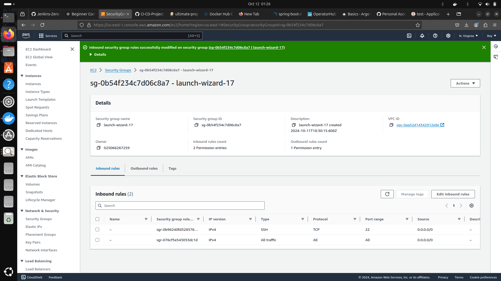
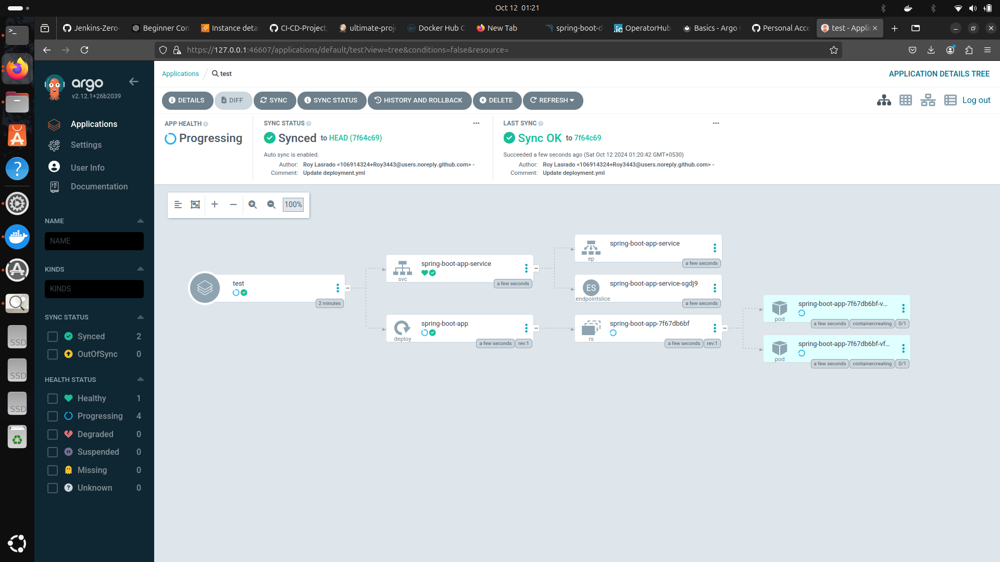
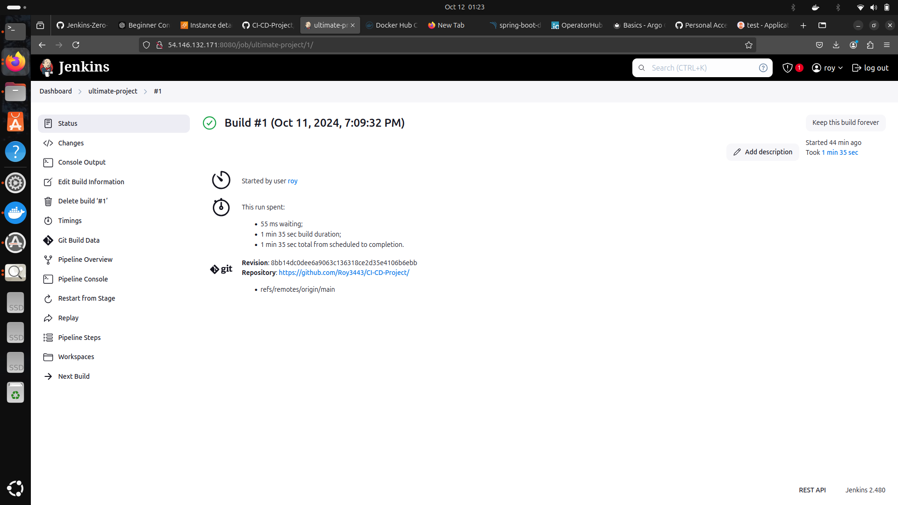
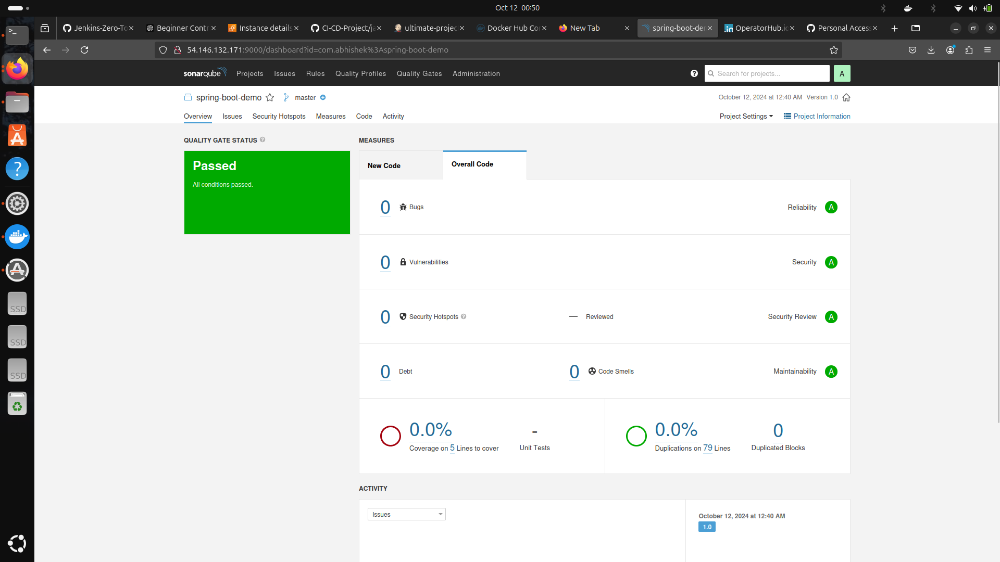

### End to End CI/CD Implementation 
### Tech Stack:
Jenkins, Docker, Kubernetes, SonarQube, Argo CD, AWS 
### Description
Implemented an end-to-end CI/CD pipeline for Java Based Application using Jenkins declarative pipeline which included 
various stages such as Build, Static Code Analysis, Creation of Docker Images, Deployment on Kubernetes platform using 
Argo CD. 

<h2>Images:</h2>

